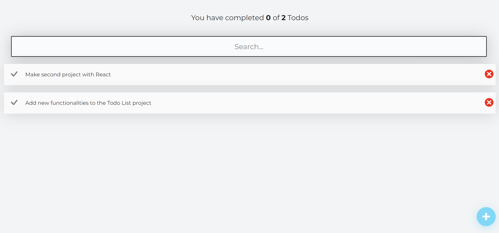

# TodoList-React-App Documentation

## Project Overview

The TodoList-React-App is a personal project, my first using React, which offers a user-friendly interface to manage tasks. The application provides functionality to add, delete, and mark tasks as done with enhanced features such as unchecking completed tasks and prompting users to add new ones when empty.

## Key Features

- React Implementation: Showcases foundational React development skills.
- Unique ID for Todos: Utilizes `uuidv4` to assign unique identifiers, addressing the issue of managing identical todo items.
- Enhanced User Experience: Allows unchecking of todos and includes prompts for adding tasks to an empty list.
- Persistence with Local Storage: Retains todos after a page refresh, enhancing usability.

## Technologies Used

- React.js: The core framework for building the user interface.
- uuidv4 Library: Generates unique identifiers for todo items, drawing on my experience with JavaScript and libraries like Axios.
- HTML & CSS: For structuring and styling the application.

## Challenges and Learnings

- Addressing the management of identical todos taught me the importance of unique identifiers in list-based applications.
- Implementing local storage introduced me to data persistence in web applications, a crucial aspect of user experience.

## :star: Future Enhancements

### Planned Features:

- **User Authentication with Firebase**: To provide personalized user experiences and secure logins.
- **Task Prioritization**: Enabling users to categorize tasks based on their importance.
- **Dark Mode**: Offering a dark/light mode for user comfort and preference.
- **Internationalization (i18n)**: Adding multi-language support for broader accessibility.

_These enhancements aim to make the TodoList app more functional, user-friendly, and globally accessible._

## Screenshots/Demo

